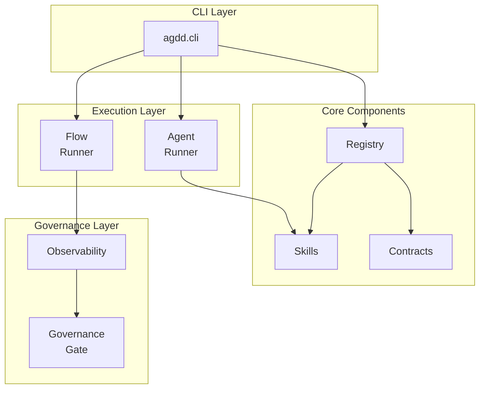

# AG-Driven Development (AGDD) Framework

[](./LICENSE)
[](https://www.python.org/downloads/)
[](https://github.com/artificial-intelligence-first/agdd/actions)

A comprehensive framework for building, executing, and governing AI agent-driven workflows with built-in quality controls and observability.

## Table of Contents

- [Overview](#overview)
- [Features](#features)
- [Architecture](#architecture)
- [Quick Start](#quick-start)
- [Project Structure](#project-structure)
- [Usage](#usage)
- [Documentation](#documentation)
- [Development](#development)
- [Contributing](#contributing)

## Overview

The AGDD Framework enables developers to build and manage automated agent-driven workflows with built-in quality controls and observability.

**Key Capabilities:**
- AI-First Development: Build workflows invokable via agents and skills
- Comprehensive Observability: Track execution metrics, token usage, and costs
- Governance & Policy: Enforce quality thresholds and compliance checks
- Pluggable Architecture: Integrate with Flow Runner or custom execution engines
- Contract-Driven Design: JSON Schema validation for all data structures

## Features

### Core Infrastructure
- Agent Registry: Centralized management of agent descriptors and task routing
- Skills Framework: Reusable, composable skills for agent capabilities
- Contract Verification: Automated JSON Schema validation
- CLI Interface: Typer-powered command-line tools

### Advanced Capabilities
- Runner Plugins: Pluggable execution engines (Flow Runner included)
- MAG/SAG Architecture: Main and Sub-Agent orchestration patterns
- Observability: Comprehensive metrics, traces, and cost tracking
- Governance Gates: Policy-based validation and compliance checks

### Developer Experience
- Type Safety: Full mypy strict mode support
- Modern Tooling: uv package manager integration
- Automated Testing: pytest with comprehensive coverage
- CI/CD Pipeline: Multi-stage validation and quality gates

## Architecture



## Project Structure

```
agdd/
├── agdd/                       # Core Python package
│   ├── cli.py                  # CLI entry point
│   ├── registry.py             # Agent/skill resolution
│   ├── runners/                # Execution engines
│   ├── governance/             # Policy enforcement
│   ├── skills/                 # Built-in skills
│   └── assets/                 # Bundled resources
├── agents/                     # Agent implementations
│   ├── main/                   # Main Agents (MAG)
│   └── sub/                    # Sub-Agents (SAG)
├── registry/                   # Configuration
│   ├── agents.yaml             # Task routing
│   └── skills.yaml             # Skill definitions
├── contracts/                  # JSON Schemas
├── policies/                   # Governance policies
├── observability/              # Metrics aggregation
├── tools/                      # Development utilities
└── tests/                      # Test suite
```

## Quick Start

### Prerequisites

- Python 3.12+
- uv package manager ([Installation Guide](https://docs.astral.sh/uv/))

### Installation

```bash
git clone https://github.com/artificial-intelligence-first/agdd.git
cd agdd
uv sync
uv sync --extra dev  # for development
uv run -m pytest -q  # verify installation
```

### Basic Usage

```bash
# Validate agent registry
uv run python -m agdd.cli validate

# Run an agent
uv run python -m agdd.cli run hello --text "Hello, AGDD!"
```

## Usage

### CLI Commands

```bash
# Validate agent descriptors
uv run python -m agdd.cli validate

# Execute an agent
uv run python -m agdd.cli run hello --text "AGDD"
```

### Agent Orchestration

```bash
# Execute MAG (Main Agent)
echo '{"role":"Senior Engineer","level":"Senior","experience_years":8}' | \
  uv run python -m agdd.cli agent run offer-orchestrator-mag

# From file
uv run python -m agdd.cli agent run offer-orchestrator-mag \
  --json examples/agents/candidate_profile.json
```

Observability artifacts are generated in `.runs/agents/<RUN_ID>/`.

### Flow Runner

```bash
# Check availability
uv run python -m agdd.cli flow available

# Validate flow
uv run python -m agdd.cli flow validate examples/flowrunner/prompt_flow.yaml

# Execute flow
uv run python -m agdd.cli flow run examples/flowrunner/prompt_flow.yaml
```

### Observability

```bash
# Generate summary
uv run python -m agdd.cli flow summarize

# Custom directory
uv run python -m agdd.cli flow summarize --base /path/to/.runs

# Output to file
uv run python -m agdd.cli flow summarize --output flow_summary.json
```

Summary metrics include execution stats, errors, MCP calls, per-step performance, and per-model resource usage.

### Governance

```bash
# Enforce quality thresholds
uv run python -m agdd.cli flow gate flow_summary.json \
  --policy policies/flow_governance.yaml
```


## Documentation

- [AGENTS.md](./AGENTS.md) - Development playbook and workflow guide
- [SSOT.md](./SSOT.md) - Terminology and policies reference
- [PLANS.md](./PLANS.md) - Roadmap and execution plans
- [RUNNERS.md](./RUNNERS.md) - Runner capabilities and integration
- [CHANGELOG.md](./CHANGELOG.md) - Version history

## Development

### Workflow

1. Review `SSOT.md` for terminology and policies
2. Update `PLANS.md` before making changes
3. Implement changes following `AGENTS.md` guidelines
4. Run validation checks
5. Update `CHANGELOG.md`
6. Submit pull request

### Validation

```bash
# Run tests
uv run -m pytest -q

# Check documentation
uv run python tools/check_docs.py

# Verify vendor assets
uv run python tools/verify_vendor.py

# Lint registry
uv run python tools/lint_registry.py
```

## Contributing

Contributions are welcome. Please refer to [AGENTS.md](./AGENTS.md) for the complete development workflow and PR policy.

### Requirements

- Pass all automated tests and validation checks
- Follow documentation standards
- Update relevant documentation files
- Record terminology changes in `SSOT.md`
- Add tests for new features
- Update `CHANGELOG.md`

### Code Quality

- Type Safety: Full mypy strict mode compliance
- Formatting: ruff for linting and formatting
- Testing: pytest with comprehensive coverage
- Documentation: Clear docstrings and updated guides

## License

This project is licensed under the MIT License - see the [LICENSE](./LICENSE) file for details.

Copyright © 2025 Naru Kijima
