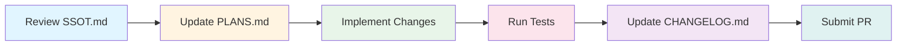

<div align="center">

# AG-Driven Development (AGDD) Framework

[](./LICENSE)
[](https://www.python.org/downloads/)
[](https://github.com/artificial-intelligence-first/agdd/actions)
[](https://github.com/astral-sh/ruff)

**A comprehensive framework for building, executing, and governing AI agent-driven workflows with built-in quality controls and observability.**

[Features](#features) • [Quick Start](#quick-start) • [Documentation](#documentation) • [Contributing](#contributing)

</div>

---

## 📋 Table of Contents

- [Overview](#overview)
- [Features](#features)
- [Quick Start](#quick-start)
- [Project Structure](#project-structure)
- [Usage](#usage)
  - [Walking Skeleton CLI](#walking-skeleton-cli)
  - [Agent Orchestration](#agent-orchestration-cli)
  - [Flow Runner Integration](#flow-runner-cli)
  - [Observability](#observability)
- [Documentation](#documentation)
- [Development Workflow](#development-workflow)
- [Contributing](#contributing)
- [License](#license)

## 🎯 Overview

The **AGDD Framework** enables developers to build and manage automated agent-driven workflows with built-in quality controls and observability. The system provides a complete infrastructure for:

- 🤖 **AI-First Development**: Build workflows that are invokable via agents and skills
- 📊 **Comprehensive Observability**: Track execution metrics, token usage, and costs
- 🛡️ **Governance & Policy**: Enforce quality thresholds and compliance checks
- 🔌 **Pluggable Architecture**: Integrate with Flow Runner or custom execution engines
- 📦 **Contract-Driven Design**: JSON Schema validation for all data structures

## ✨ Features

<table>
<tr>
<td width="50%">

### 🏗️ Core Infrastructure

- **Agent Registry**: Centralized management of agent descriptors and task routing
- **Skills Framework**: Reusable, composable skills for agent capabilities
- **Contract Verification**: Automated JSON Schema validation
- **Walking Skeleton CLI**: Typer-powered command-line interface

</td>
<td width="50%">

### 🔧 Advanced Capabilities

- **Runner Plugins**: Pluggable execution engines (Flow Runner included)
- **MAG/SAG Architecture**: Main and Sub-Agent orchestration patterns
- **Observability**: Comprehensive metrics, traces, and cost tracking
- **Governance Gates**: Policy-based validation and compliance checks

</td>
</tr>
<tr>
<td width="50%">

### 📦 Developer Experience

- **Packaged Resources**: Bundled schemas and policies
- **Documentation Standards**: Enforced documentation guardrails
- **Type Safety**: Full mypy strict mode support
- **Modern Tooling**: uv package manager integration

</td>
<td width="50%">

### 🚀 CI/CD Integration

- **Automated Testing**: pytest with comprehensive coverage
- **Multi-Stage Pipeline**: Core, Flow Runner, and Governance jobs
- **Artifact Publishing**: Flow summaries and metrics
- **Quality Gates**: Linting, type checking, and vendor verification

</td>
</tr>
</table>

## 📁 Project Structure

```
agdd/
├── 📦 agdd/                    # Core Python package
│   ├── cli.py                  # Typer-based CLI entry point
│   ├── registry.py             # Agent and skill resolution
│   ├── runners/                # Execution engine adapters
│   │   ├── agent_runner.py     # MAG/SAG orchestration
│   │   ├── flowrunner.py       # Flow Runner integration
│   │   └── base.py             # Runner interface
│   ├── governance/             # Policy enforcement
│   │   └── gate.py             # Governance gate evaluation
│   ├── skills/                 # Built-in skills
│   │   └── echo.py             # Example skill
│   └── assets/                 # Bundled resources
│       ├── contracts/          # JSON Schemas
│       └── policies/           # Governance policies
│
├── 🤖 agents/                  # Agent implementations
│   ├── main/                   # Main Agents (MAG)
│   │   └── offer-orchestrator-mag/
│   └── sub/                    # Sub-Agents (SAG)
│       └── compensation-advisor-sag/
│
├── 📋 registry/                # Agent and skill registries
│   ├── agents.yaml             # Task routing configuration
│   ├── skills.yaml             # Skill definitions
│   └── agents/                 # Agent descriptors
│       └── hello.yaml
│
├── 📜 contracts/               # JSON Schema definitions
│   ├── agent.schema.json
│   ├── flow_summary.schema.json
│   ├── candidate_profile.schema.json
│   └── offer_packet.schema.json
│
├── 🛡️ policies/                # Governance policies
│   └── flow_governance.yaml
│
├── 📊 observability/           # Metrics and monitoring
│   └── summarize_runs.py       # Run aggregation
│
├── 🔧 tools/                   # Development utilities
│   ├── gate_flow_summary.py
│   ├── verify_vendor.py
│   └── lint_registry.py
│
├── 🧪 tests/                   # Test suite
│   ├── unit/
│   ├── integration/
│   ├── contract/
│   └── cli/
│
└── 📚 Documentation
    ├── README.md               # This file
    ├── AGENTS.md               # Developer guide
    ├── PLANS.md                # Roadmap and planning
    ├── SSOT.md                 # Terminology reference
    ├── RUNNERS.md              # Runner documentation
    └── CHANGELOG.md            # Version history
```

## 🚀 Quick Start

### Prerequisites

- **Python 3.12+** - [Download](https://www.python.org/downloads/)
- **uv** - Modern Python package manager ([Installation Guide](https://docs.astral.sh/uv/))

### Installation

```bash
# Clone the repository
git clone https://github.com/artificial-intelligence-first/agdd.git
cd agdd

# Install dependencies
uv sync

# Install development extras (recommended)
uv sync --extra dev

# Verify installation
uv run -m pytest -q
```

### First Steps

```bash
# Validate agent registry
uv run python -m agdd.cli validate

# Run the hello agent
uv run python -m agdd.cli run hello --text "Hello, AGDD!"
```

<details>
<summary><b>Optional: Install Flow Runner</b></summary>

For advanced flow execution capabilities:

```bash
# Clone Flow Runner
git clone https://github.com/artificial-intelligence-first/flow-runner.git
cd flow-runner

# Install Flow Runner packages
uv sync
uv pip install -e packages/mcprouter -e packages/flowrunner

# Configure environment
cd ..
source tools/flowrunner_env.sh
```

</details>

## 💻 Usage

### Walking Skeleton CLI

The walking skeleton demonstrates the core AI-first pipeline:

```bash
# Validate all agent descriptors
uv run python -m agdd.cli validate

# Execute an agent skill
uv run python -m agdd.cli run hello --text "AGDD"
```

### Agent Orchestration CLI

Execute MAG (Main Agent) and SAG (Sub-Agent) workflows:

```bash
# Generate an offer packet from candidate profile (stdin)
echo '{"role":"Senior Engineer","level":"Senior","experience_years":8}' | \
  uv run python -m agdd.cli agent run offer-orchestrator-mag

# Or from a file
uv run python -m agdd.cli agent run offer-orchestrator-mag \
  --json examples/agents/candidate_profile.json
```

**Output**: Observability artifacts are generated in `.runs/agents/<RUN_ID>/` containing logs, metrics, and execution summaries.

### Flow Runner CLI

The runner boundary exposes Flow Runner commands once `flowctl` is available:

```bash
# Check Flow Runner availability
uv run python -m agdd.cli flow available

# Validate a flow definition
uv run python -m agdd.cli flow validate examples/flowrunner/prompt_flow.yaml

# Execute a flow (dry-run)
uv run python -m agdd.cli flow run examples/flowrunner/prompt_flow.yaml --dry-run

# Execute a flow (produces .runs/ artifacts)
uv run python -m agdd.cli flow run examples/flowrunner/prompt_flow.yaml
```

> **Note**: `flow available` reports the detected runner version and capability set. Example flows are available in `examples/flowrunner/` with schema at `contracts/flow.schema.json` (tag `flowrunner-v1.0.0`).

### Observability

Flow Runner executions emit structured artifacts under `.runs/<RUN_ID>/`. Generate comprehensive summaries:

```bash
# Summarize runs from default directory
uv run python -m agdd.cli flow summarize

# Target a custom directory
uv run python -m agdd.cli flow summarize --base /path/to/.runs

# Write summary to file for governance
uv run python -m agdd.cli flow summarize --output governance/flow_summary.json
```

**Summary Metrics Include:**

| Category | Metrics |
|----------|---------|
| **Execution** | runs, successes, success_rate, avg_latency_ms |
| **Errors** | total failures, error-type breakdown |
| **MCP** | calls, errors, aggregated tokens, cost |
| **Steps** | per-step run count, success rate, latency, models |
| **Models** | per-model calls, errors, tokens, cost |

**Governance Gate:**

Enforce quality thresholds defined in `policies/flow_governance.yaml`:

```bash
uv run python -m agdd.cli flow gate governance/flow_summary.json \
  --policy policies/flow_governance.yaml
```

> **Schema**: The summary contract is defined in `contracts/flow_summary.schema.json`. CI automatically publishes summary artifacts alongside test results.

<details>
<summary><b>Packaged Resources</b></summary>

The CLI depends on JSON Schemas and governance policies distributed within the `agdd` wheel under `agdd/assets/`. Building and testing the package:

```bash
# Build the wheel
uv build

# Test in disposable environment
python -m venv .venv_pkgtest
.venv_pkgtest/bin/pip install dist/agdd-*.whl
.venv_pkgtest/bin/agdd validate

# Cleanup
rm -rf .venv_pkgtest
```

</details>

## 📚 Documentation

| Document | Description |
|----------|-------------|
| **[AGENTS.md](./AGENTS.md)** | Local development playbook and workflow guide |
| **[SSOT.md](./SSOT.md)** | Single source of truth for terminology and policies |
| **[PLANS.md](./PLANS.md)** | Execution plans and roadmap |
| **[RUNNERS.md](./RUNNERS.md)** | Runner capabilities, conformance, and swap guidance |
| **[CHANGELOG.md](./CHANGELOG.md)** | Version history and updates |

## 🔄 Development Workflow



### Development Steps

1. **Review** `SSOT.md` for terminology and policies
2. **Plan** - Update `PLANS.md` before making changes
3. **Test** - Smoke test the walking skeleton:
   ```bash
   uv run python -m agdd.cli validate
   uv run python -m agdd.cli run hello
   ```
4. **Implement** - Follow guidelines in `AGENTS.md`
5. **Validate** - Run all checks:
   ```bash
   uv run -m pytest -q
   uv run python tools/check_docs.py
   uv run python tools/verify_vendor.py
   uv run python tools/lint_registry.py
   ```
6. **Document** - Update `CHANGELOG.md` upon completion
7. **Submit** - Create a pull request

## 🤝 Contributing

We welcome contributions! Please refer to **[AGENTS.md](./AGENTS.md)** for the complete development workflow and PR policy.

### Contribution Checklist

- ✅ Pass all automated tests and validation checks
- ✅ Follow documentation standards
- ✅ Update relevant documentation files
- ✅ Record terminology changes in `SSOT.md`
- ✅ Add tests for new features
- ✅ Update `CHANGELOG.md` with your changes

### Code Quality Standards

- **Type Safety**: Full mypy strict mode compliance
- **Formatting**: ruff for linting and formatting
- **Testing**: pytest with comprehensive coverage
- **Documentation**: Clear docstrings and updated guides

## 📄 License

This project is licensed under the **MIT License** - see the [LICENSE](./LICENSE) file for details.

**Copyright © 2025 Naru Kijima**

---

<div align="center">

**Built with ❤️ for AI-First Development**

[⬆ Back to Top](#ag-driven-development-agdd-framework)

</div>
